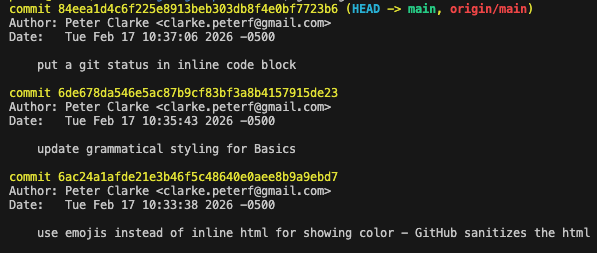

## Basics

### Make a local copy of this repository

If you use https credentials:

```
git clone https://github.com/clarkepeterf/git-pro.git
```

If you use ssh credentials:

```
git clone git@github.com:clarkepeterf/git-pro.git
```

You can also name a repository something different if you like:

```
git clone git@github.com:clarkepeterf/git-pro.git todays-presentation
```

### Check out a branch

Edit a set of changes that you or a peer worked on previously:

```
git checkout feature-branch-1
```

### Make changes

View the current status of your repository:

```
git status
```

At this point it should say "nothing to commit, working tree clean"

#### Before we do more, here is some background info

**A file tracked by git can be in one of 3 states**:

1. **Modified** - the file has been changed, but those changes have not been stored in the repository. Modified files show up as red 🔴 in `git status`
2. **Staged** - the file has been changed and is _marked_ to be committed. Staged files show up as green 🟢 in `git status`
3. **Committed** - the changes have been stored in the repository. Committed files no longer show up in `git status`

**Files can also be**:

1. **Untracked** - a file not previously added and committed to the repository. Untracked files show up separately and are also red 🔴 in `git status`
2. **Ignored** - add a file to .gitignore to ensure git does not track it - used for things like .env, \*.pem, other personal or secret-containing files

#### Examples

##### A)

1. Edit **src/hello.js** so that it says `hello("$YOUR_NAME")` instead of `hello("World")` and save the file
2. Execute `git status` in your terminal
3. **hello.js** should show as **modified** in git's output

##### B)

1. Create a file called **new.js**
2. Execute `git status` in your terminal
3. **new.js** should show as an **untracked** file in git's output

##### C)

1. Follow examples A and B above
2. Execute `git add src/hello.js` in your terminal
3. Execute `git status` in your terminal
4. Now **hello.js** should be **staged** and **new.js** should still be **untracked** in git's output
5. Execute `git commit -m "adding my name to hello.js"` in your terminal
6. Execuite `git status` in your terminal
7. Now **hello.js** no longer shows up in git's output. Its changes have been committed and stored in the repository. **new.js** is still **untracked** - it can be tracked later with another `git add` and `git commit`

### View commit history

You can view commit history with:

```
git log
```

This will show output like:



To exit the git log pager, type `q`

### Documentation links

Here are official documentation links to the git commands discussed in this section:

- [git clone](https://git-scm.com/docs/git-clone)
- [git checkout](https://git-scm.com/docs/git-checkout)
- [git status](https://git-scm.com/docs/git-status)
- [git add](https://git-scm.com/docs/git-add)
- [git commit](https://git-scm.com/docs/git-commit)
- [git log](https://git-scm.com/docs/git-log)
